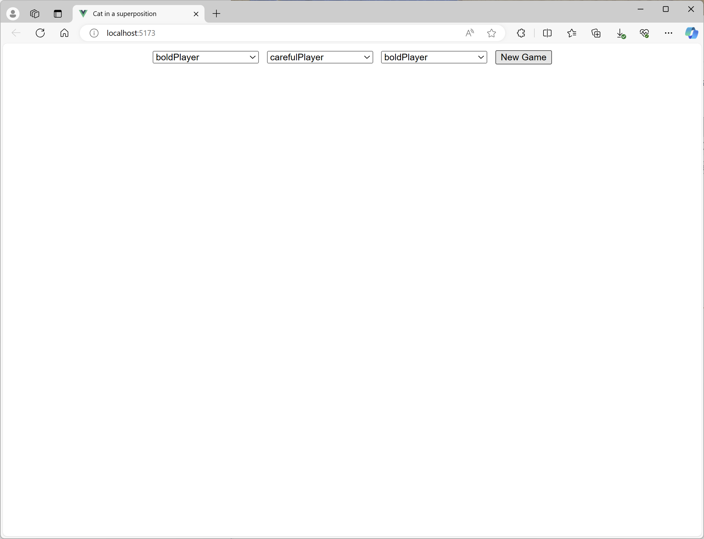
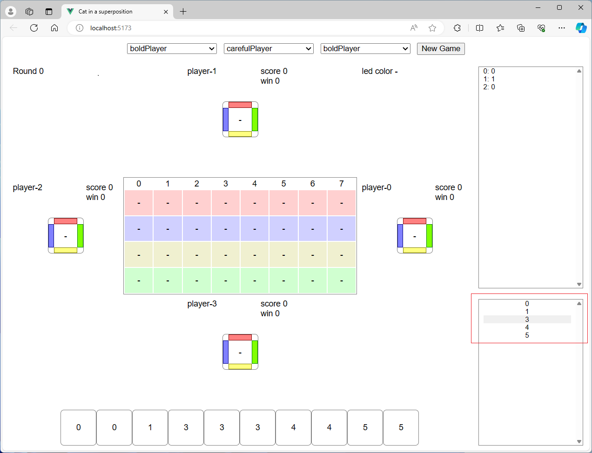
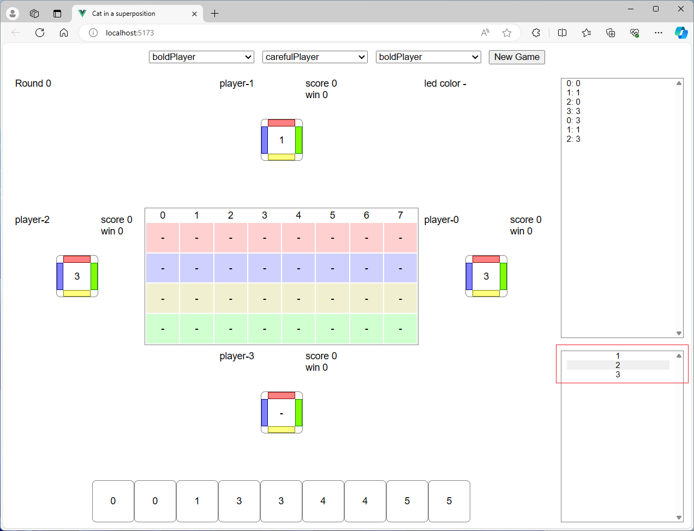
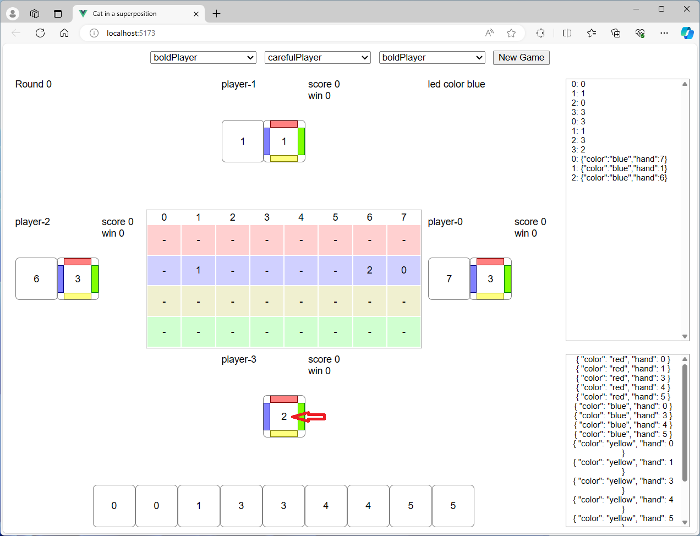
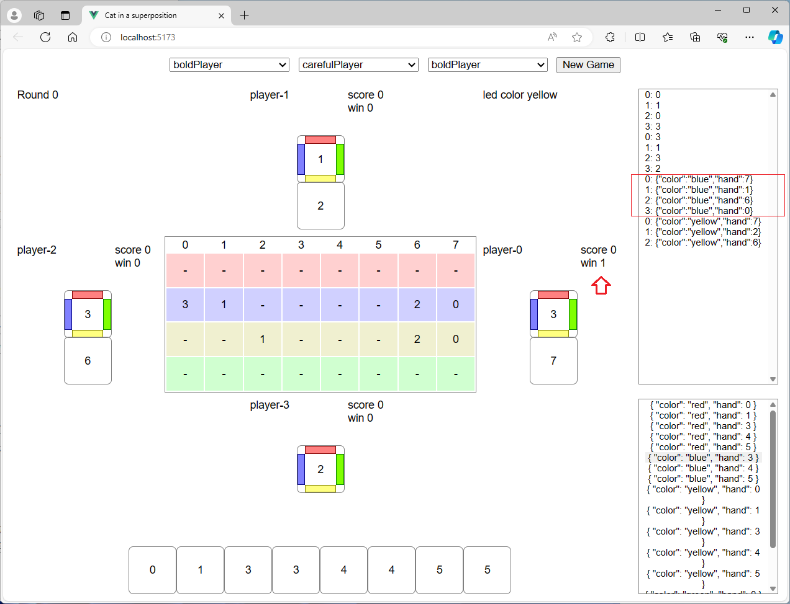
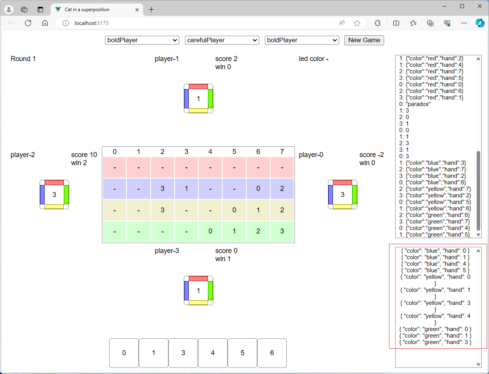
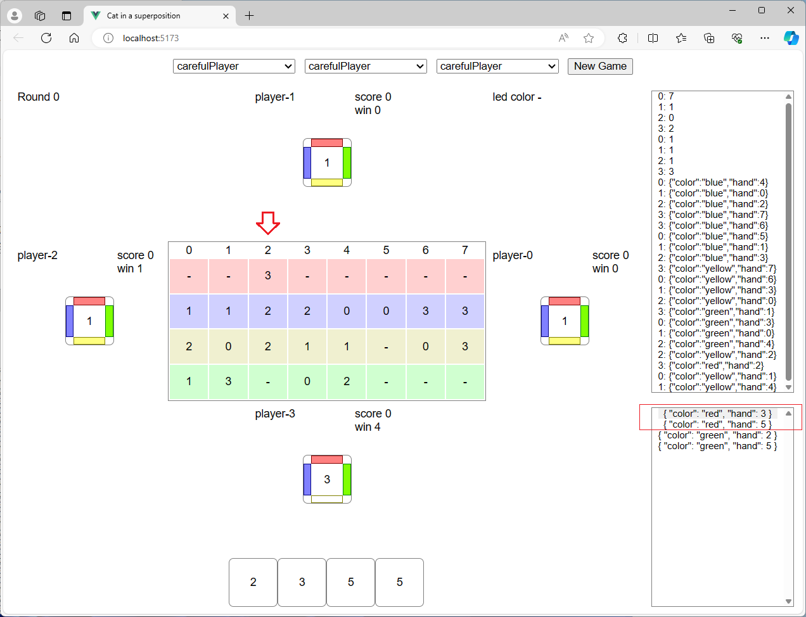
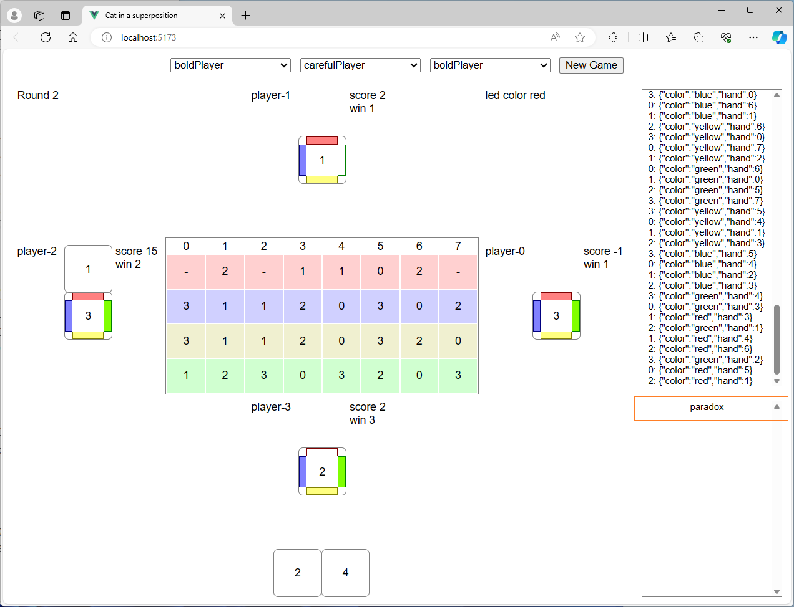
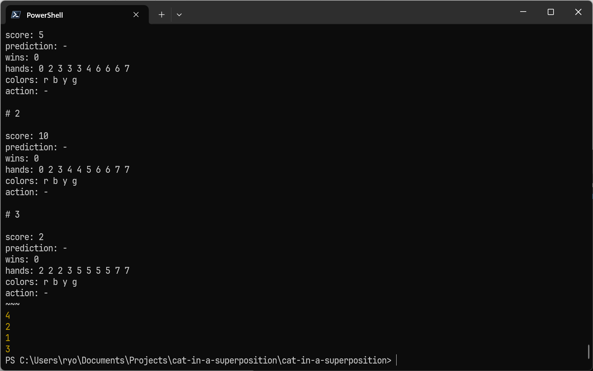

# 課題とコンクールの進め方

[Cat in the box](https://www.amazon.co.jp/%E3%83%9B%E3%83%93%E3%83%BC%E3%82%B8%E3%83%A3%E3%83%91%E3%83%B3-%E3%82%AD%E3%83%A3%E3%83%83%E3%83%88%E3%83%BB%E3%82%A4%E3%83%B3%E3%83%BB%E3%82%B6%E3%83%BB%E3%83%9C%E3%83%83%E3%82%AF%E3%82%B9-2-5%E4%BA%BA%E7%94%A8-13%E6%89%8D%E4%BB%A5%E4%B8%8A%E5%90%91%E3%81%91-%E3%83%9C%E3%83%BC%E3%83%89%E3%82%B2%E3%83%BC%E3%83%A0/dp/B0B4VG55MJ)によく似たボード・ゲームをプレイするAIを作成してください。あと、このゲームに興味を持った方は、[Cat in the box](https://www.amazon.co.jp/%E3%83%9B%E3%83%93%E3%83%BC%E3%82%B8%E3%83%A3%E3%83%91%E3%83%B3-%E3%82%AD%E3%83%A3%E3%83%83%E3%83%88%E3%83%BB%E3%82%A4%E3%83%B3%E3%83%BB%E3%82%B6%E3%83%BB%E3%83%9C%E3%83%83%E3%82%AF%E3%82%B9-2-5%E4%BA%BA%E7%94%A8-13%E6%89%8D%E4%BB%A5%E4%B8%8A%E5%90%91%E3%81%91-%E3%83%9C%E3%83%BC%E3%83%89%E3%82%B2%E3%83%BC%E3%83%A0/dp/B0B4VG55MJ)を購入して対人でプレイしてください。

**07/01 申し訳ありません。課題確認のプログラムにバグがありました。再ダウンロードをお願いいたします。修正点は、observationで自分以外のプレイヤーの捨て札のリーク防止です。自分以外のプレイヤーでは-1となるよう変更しました。**

**07/19 申し訳ありません。課題とコンクールの進め方の記述に間違いがありました。修正点は、ゲーム開始時の入力（"initialize"となっていましたが、正しくは"beginGame"でした）と、観測のパラメーター（Player.actionsとなっていましたが、正しくはPlayer.actionでした）です。**

## ルール

Cat in a superpositionのルールを、[課題確認](./dist/index.html)の画面を使用して説明します。[課題確認](./dist/index.html)に遷移して、右上の[New Game]ボタンをクリックしてください。

Cat in a superpositionは4人で4ラウンドを実施し、各ラウンドで獲得した得点の合計で順位を決定するゲームです。各ラウンドで、プレイヤーは中央のボード上にカードの色を宣言していきます。ただし、既に中央のボードに宣言されたカードと色は宣言できません。Cat in a supoerpositionのカードは番号あたり<b>5枚</b>あるのに、中央のボードの色は<b>4色</b>しかありませんから、カードの色を宣言できなくなる可能性があります。また、各プレイヤーの前に置かれたボードには、上下左右にそのプレイヤーが宣言可能な色が表示されています。プレイヤーの行動によってはこの宣言可能な色が減るため、色を宣言できなくなる可能性は大きなものとなることにご注意ください。

ラウンドの開始時には、手札としてカードが10枚配られます。本ゲームのカードにはスートはなく、数字のみが記載されています。Cat in a superpositionのラウンドは、以下に示す準備フェイズとトリック・フェイズ、得点フェイズの3つで構成されています。

### 準備フェイズ

最初にプレイヤーがすることは、不要なカードを一枚選択することです。画面の右下に表示されている実行可能なアクションの中から、破棄する不要なカードを選択してください。

次に、このラウンドで、後述するトリックに何回勝てるかを予測します。勝利数として選択できるのは1〜3です。予測した勝利数を選択してください。選択した値が自分の前のボードに表示されます。

### トリック・フェイズ

トリック・フェイズでは、反時計回りの順番で、各プレイヤーが持っているカードから1枚選んで色を宣言していきます。ただし、このラウンド中に中央のボードですでに宣言された色とカードは使用できません。また、最初にカードを出したプレイヤーが宣言した色（led colorとして画面の右上に表示されています）以外の色を宣言すると、自分の前のボードからその色が消え、以降はその色を宣言できなくなります。宣言可能な色とカードの組み合わせは画面の右下に表示されていますので、その中から一つ選択してください。

全てのプレイヤーが宣言をしたら、トリックの勝者を決定します。勝者はこのトリックで宣言した色→カードの数字の順で決定されます。色は、赤がいちばん強く、次に強いのはled colorとなります。色の強さが同じ場合はカードの数字が大きい人がそのトリックに勝利し、プレイヤーの前のwinの数が1増えます。

<small>※一つ前のトリックでは全員がled colorである青を宣言したので、数字が一番大きいplayer-0がトリックに勝利しました。</small>

トリックの勝者が、次のトリックで最初にカードを出します。最初にカードを出すときは、すでに誰かが赤を宣言した後でなければ赤は宣言できません。ただし、誰も赤を宣言していない場合でも、赤以外を宣言できない場合は赤を宣言できます。

<small>※まだ誰も赤を宣言していないので、赤は出せません。</small>

<small>※すでに赤が宣言されているので、赤を出せます。</small>

このトリックを、プレイヤーが持つカードが残り1枚になるまで繰り返して、後述する得点フェイズに移ります。残り1枚になる前にカードの色を宣言できなくなったときは、選択可能なアクションには「paradox」しか出てきません。プレイヤーの誰かがparadoxを選択した場合は、そのトリックの勝利判定は実施せずに得点フェイズに移ります。

<small>※4は全色宣言済みなので宣言できません。赤の2は宣言されていませんが、プレイヤー・ボードの赤が消えているので宣言できません。</small>

### 得点フェイズ

トリックの勝利1回につき1点を獲得します。ただし、paradoxを宣言したプレイヤーは、勝利した数だけスコアを減らされます。

勝利数の他に、ボーナス得点もあります。準備フェイズで予測した勝利数と実際の勝利数が同じだった場合、かつ、paradoxを宣言しなかった場合に、ボーナス獲得の権利が発生します。ボーナス得点は、中央のボード上の自分の宣言が縦もしくは横（斜めは駄目）で隣接している数の中で最大のものです。

<small>※勝利数と勝利予測が同じ、かつ、paradoxを宣言していない場合は、中央のボードの宣言が縦横で隣接した数の最大値がボーナス得点になります。</small>

<small>※最後のトリックはplayer-0のparadoxで終了したので勝利数に変更はなく、ボーナス得点を得ました。スコアが、勝利数1とボーナス得点4を合わせた5になっています。</small>

得点計算が終わると各プレイヤーの前のscoreが更新され、次のラウンドに移ります。ラウンドで最初にカードを出すのは、ラウンド数に一致するプレイヤーです。ラウンド0ではプレイヤー0が、ラウンド1ではプレイヤー1が最初にカードを出すプレイヤーになります。[課題確認](./dist/index.html)でプレイする場合あなたはプレイヤー3なので、最後のラウンドで最初にカードを出すプレイヤーになります。

全4ラウンドが終了したら、得点が多い順で順位を決定します。同じ得点のプレイヤーがいた場合は同順となります。1位が2名いた場合、次に得点が大きいプレイヤーの順位は3位になります。

以上でルールの説明は終了です。

蛇足ですが、プログラミング・コンクールは業務です。<b>業務として</b>[課題確認](./dist/index.html)でCat in a superpositionを<b>プレイ</b>して、ゲームのルールを理解してみてください。

## 作成していただくプログラムの仕様

作成していただくプログラムは、ゲームの状態や実行可能なアクションの配列を標準入力から受信し、選択したアクションを標準出力に送信しなければなりません。送受信データのフォーマットはJSONで、1つのデータを1行で表現します。

プログラムが処理しなければならない通信には、ゲーム開始とアクション選択、観測、ゲーム終了の4種類があります。

### ゲーム開始

ゲームを開始するときに発生します。プログラムの初期化処理に使用してください。

入力は`{"command":"beginGame","parameter":プレイヤー・インデックス}`です（プレイヤー・インデックスは0〜3の整数）。プログラムの初期化処理が完了したら、JSON形式のデータを何か（`OK`等）出力してください。

### アクション選択

ターンが回ってきたときに発生します。実行するアクションを選択してください。

入力は、以下のUMLのクラス図（nullになる可能性を型の?で表現しています）で示す情報がJSONで渡ってきます。アクションには「不要カード選択」と「勝利数予測」、「カードの色の宣言」の3種類があります。どのアクションが求められているのかは`Player.phase`で判断してください。0は「不要カード選択」で1は「勝利数予測」、2は「カードの色の宣言」です。

|名称|説明|
|:-- | :-- |
|Parameter|アクション選択のためのパラメーター|
|Parameter.board|中央のボードの情報|
|Parameter.players|プレイヤーの情報|
|Parameter.turn|ターン。プレイヤー全員の勝利予測が終了するまで0、それ以降はアクションが実行されるたびに1ずつ増えます|
|Parameter.ledColor|最初にカードを出したプレイヤーが宣言した色|
|Parameter.legalActions|合法手。この中から実行するアクションを選択してください|
|Board|中央のボード|
|Board.red|赤のラインの情報。宣言済みであれば宣言したプレイヤーのインデックス、そうでなければnull|
|Board.blue|青のラインの情報。宣言済みであれば宣言したプレイヤーのインデックス、そうでなければnull|
|Board.yellow|黄のラインの情報。宣言済みであれば宣言したプレイヤーのインデックス、そうでなければnull|
|Board.green|緑のラインの情報。宣言済みであれば宣言したプレイヤーのインデックス、そうでなければnull|
|Player|プレイヤーの情報|
|Player.playerIndex|プレイヤーのインデックス。player-0なら0、player-1なら1、player-2なら2、player-3なら3|
|Player.hands|プレイヤーの手札。自分以外の場合はnull|
|Player.score|プレイヤーのスコア|
|Player.phase|プレイヤーのアクション選択のフェイズ。0は「不要カード選択」で1は「勝利数予測」、2は「カードの色の宣言」|
|Player.colors|プレイヤーの前のボードの宣言可能な色の情報|
|Player.predictionOfWinsCount|プレイヤーが予測した勝利数。予測するまではnull|
|Player.winsCount|当該ラウンドでのプレイヤーの勝利数|
|Player.action|プレイヤーが選択したアクション。選択するまではnull|
|Colors|プレイヤーの前のボードの宣言可能な色の情報|
|Colors.red|赤を宣言可能ならtrue、そうでなければfalse|
|Colors.blue|青を宣言可能ならtrue、そうでなければfalse|
|Colors.yellow|黄を宣言可能ならtrue、そうでなければfalse|
|Colors.green|緑を宣言可能ならtrue、そうでなければfalse|
|Action|アクション|
|DiscardHand|実際の型はint。不要カードの数字|
|PredictWinsCount|実際の型はint。勝利数予測|
|DeclareObservedColor|カードの色の宣言|
|DeclareObservedColor.color|宣言する色|
|DeclareObservedColor.hand|宣言するカードの数字|
|Paradox|実際の型はstring。値は"paradox"のみ|

出力は、選択したアクションをそのまま出力してください。

### 観測

自分を含む全てのプレイヤーのアクションが実行された後に発生します。

入力は、以下のUMLのクラス図で示す情報がJSONで渡ってきます。敵プレイヤーがどのようなアクションを選択したのかを元に敵の手札や狙いを予測したり、盤面の推移から取り得る戦術を取捨選択したりしてみてください。処理が完了したら、JSON形式のデータを何か（`OK`等）出力してください。

|名称|説明|
|:-- | :-- |
|Parameter|観測のためのパラメーター|
|Parameter.board|中央のボードの情報|
|Parameter.players|プレイヤーの情報|
|Parameter.turn|ターン。プレイヤー全員の勝利予測が終了するまで0、それ以降はアクションが実行されるたびに1ずつ増えます|
|Parameter.actionPlayerIndex|アクションを実行したプレイヤーのインデックス|
|Parameter.action|プレイヤーが実行したアクション|
|Board|中央のボード|
|Board.red|赤のラインの情報。宣言済みであれば宣言したプレイヤーのインデックス、そうでなければnull|
|Board.blue|青のラインの情報。宣言済みであれば宣言したプレイヤーのインデックス、そうでなければnull|
|Board.yellow|黄のラインの情報。宣言済みであれば宣言したプレイヤーのインデックス、そうでなければnull|
|Board.green|緑のラインの情報。宣言済みであれば宣言したプレイヤーのインデックス、そうでなければnull|
|Player|プレイヤーの情報|
|Player.playerIndex|プレイヤーのインデックス。player-0なら0、player-1なら1、player-2なら2、player-3なら3|
|Player.hands|プレイヤーの手札。自分以外の場合はnull|
|Player.score|プレイヤーのスコア|
|Player.phase|プレイヤーのアクション選択のフェイズ。0は「不要カード選択」で1は「勝利数予測」、2は「カードの色の宣言」|
|Player.colors|プレイヤーの前のボードの宣言可能な色の情報|
|Player.predictionOfWinsCount|プレイヤーが予測した勝利数。予測するまではnull|
|Player.winsCount|当該ラウンドでのプレイヤーの勝利数|
|Player.action|プレイヤーが選択したアクション。選択するまではnull|
|Colors|プレイヤーの前のボードの宣言可能な色の情報|
|Colors.red|赤を宣言可能ならtrue、そうでなければfalse|
|Colors.blue|青を宣言可能ならtrue、そうでなければfalse|
|Colors.yellow|黄を宣言可能ならtrue、そうでなければfalse|
|Colors.green|緑を宣言可能ならtrue、そうでなければfalse|
|Action|アクション|
|DiscardHand|実際の型はint。不要カードの数字。**自分の場合以外は-1**|
|PredictWinsCount|実際の型はint。勝利数予測|
|DeclareObservedColor|カードの色の宣言|
|DeclareObservedColor.color|宣言する色|
|DeclareObservedColor.hand|宣言するカードの数字|
|Paradox|実際の型はstring。値は"paradox"のみ|

### ゲーム終了

ゲームを終了するときに発生します。プログラムの終了処理に使用してください。

入力はありません。プログラムの終了処理が完了したら、JSON形式のデータを何か（`OK`等）出力してください。

### 注意点

* 乱数シードが同じであれば同じカードが配られることを利用するアルゴリズム（最初に配られたカードから乱数シードを推測して敵の手札を予測したり、試合では乱数シードが固定される場合があることを利用して敵の手札を予測する等）は禁止します。乱数シードを固定せずに試合した際に大きく勝率が変化する場合は、事務局にアルゴリズムを説明していただきます。なお、カウンティングや確率、アルゴリズム等による敵の手札の予測は問題ありません。
* 有償のライブラリやプログラミング言語は使用しないでください。
* 不正なJSONの送付とルールで許されていないアクション選択が発生した場合は、そのゲームは負けとなり4位になります。自分が不利になるだけではなく、他の参加者の順位に影響がある（他の参加者全員が1位となるため、正常にゲームが進んだ場合より上の順位になる可能性がでてきます）ので、不正なJSONやルールで許されていないアクションを送付しないように気をつけてください。
* 対戦環境は、OSがWindows 11 Professional 64bitでCPUがIntel Core i7-1165G7、メモリが32GBで、ネットワークからは遮断されています。他の参加者のプログラムも同じコンピューターで実行しますので、アクションの選択が終わった後自分の手番が回ってくるまではCPUを使用しないことと、メモリを使用しすぎないことを守ってください。また、リクエストがあればGPU（NVIDIA GeForce RTX 3090）をThunderboltで接続します（申し訳ありませんが、CUDAのバージョンはGPUを必要とする参加者が合意したバージョンに固定とさせてください）。
* 受信開始から送信完了までの処理は、概ね10秒以内に完了させてください。
* ログの出力には、標準エラー出力を使用してください。標準出力は試合環境との通信で使用するためです。
* プログラムを作成する際は、[サンプル](./python-example.zip)や[課題確認（ソースコード）](./cat-in-a-superposition.zip)を参考にしてみてください。ただし、このサンプルは盤面を見ることすらしていないとても単純なものです。ご注意ください。

## 対戦環境

対戦環境は、[課題確認（ソースコード）](./cat-in-a-superposition.zip)で提供しています。使用したプログラミング言語はJavaScriptで、Node.js上で動作します。

準備として、Node.js（20.12.0で動作検証しました）をインストールし、[課題確認（ソースコード）](./cat-in-a-superposition.zip)を適当なフォルダに展開し、PowerShell（7.4.1で動作検証しました）を開いてそのフォルダに移動し、`npm install`してください。

### PowerShell上でのAI同士の対戦

AI同士を対戦させる場合は、PowerShell上で`npm --silent run play "プレイヤー0を起動するコマンド" "プレイヤー1を起動するコマンド" "プレイヤー2を起動するコマンド" "プレイヤー3を起動するコマンド" 乱数シード`を実行してください。たとえばサンプルのプレイヤーを乱数シード1で対戦させるなら、`npm --silent run play "node .\src\cli\adapter.js impatientPlayer" "node .\src\cli\adapter.js indecisivePlayer 1" "node .\src\cli\adapter.js boldPlayer" "node .\src\cli\adapter.js carefulPlayer" 1`です。乱数シードが指定されなかった場合は、ランダムなランダムシードが選択されます。

標準エラー出力にゲームの内容が、標準出力に順位が出力されます。プレイヤーが標準エラー出力に出力した内容は、.\\results\\player-?.logに出力されます。プログラムのデバッグ等でご使用ください。

ただし、Cat in a superpositionは乱数が入るので、1ゲームだけではプレイヤーの強さは測れません。プレイヤーの強さを調べたい場合は、乱数シードを固定したすべての並び順（プレイヤーの数は4なので24通り）のゲーム×4の96ゲームをプレイする`play96`を使用してください。実行するコマンドは`npm --silent run play96 "プレイヤー0を起動するコマンド" "プレイヤー1を起動するコマンド" "プレイヤー2を起動するコマンド" "プレイヤー3を起動するコマンド" 乱数シード`です。

各ゲームの詳細は、.\\results\\フォルダに出力されます。

### Webブラウザ上でのAIと人の対戦

作成したAIとWebブラウザで対戦することも可能です。AIの開発という難しい業務に取り組んでいることを理解しない上司や同僚がいたら、あなたのAIと対戦させてボロ負けさせてやりましょう。

具体的な手順としては、PowerShellを複数起動して1つ目のPowerShellで`npm run dev`し、残りのPowerShellで`npm --silent run webSocket ポート番号 "AIを起動するコマンド"`を実行してください。ポート番号は8001〜8003のどれかにしてください。

以上を実行したら、`npm run dev`した画面に表示されたURLをWebブラウザで開き、プレイヤーとして「WebSocketPlayer<i>ポート番号</i>」を選択し、[New Game]ボタンをクリックしてください。

## コンクールの進行

練習試合と公式試合を、それぞれ1回実行します。

練習試合では、ランダムな乱数シードとランダムに選択したプレイヤーでのゲームを72時間繰り返します。ゲームの順位の平均をスコアとし、このスコアが小さい順で最終順位を決定します。

練習試合は提出形式やプログラムの動作を参加者が確認するために実施するもので、選考には影響しません。練習試合では、最終順位とゲームおよび標準エラー出力の内容を、プログラムの作成者に公開します。

公式試合では、予選として練習試合と同じ形式の試合を実施し、上位4名を決定します。決勝では、この4名で乱数シードを固定して4の順列である24通りの並びでのゲームを単位に24時間繰り返して、最終順位を決定します。決勝で同着が発生した場合は、追加でランダムな並び順とランダムな乱数シードでのゲームを8時間実施して、追加試合での順位の平均で同着となった参加者の最終順位を決定します。

## コミュニケーション

プログラミング・コンクールの目的は「BIPROGYグループにおける開発力の向上および、参加者どうしの相互啓発」です。

課題のポイントを理解し、ポイントに沿う形で自身の作品の優秀さを主張してください。プログラミング・コンクールに参加する人と作品に敬意を払い、理解しあい、互いの優秀なスキルを共有してください。

参加者全員が「相互啓発」できるよう、課題についての質問や意見は参加者全員で共有することとします。参加者は、以下の事項を守ってください。

1. 課題についての質問は、後述するTeamsに投稿/回答してください。
2. 質問や回答に意見のある場合も、Teamsを使用してください。個人宛の質問や意見は不可とします。

## Teams

コミュニケーション媒体としてTeamsに「プロコン参加者」チームを用意しますので、ご活用ください。「〇〇技術についてオブザーバーが解説しろ」とかの投稿も大歓迎です。オブザーバーの能力不足で解説できない場合は、申し訳ありません、相互啓発ということで参加者の皆様のご協力をお願いするかもしれませんけど……。

1. 事務局が参加者とオブザーバーをメンバー登録します。メンバーは、課題1と課題2のどちらのチャンネルも閲覧/投稿することができます。
2. 各課題の質問や連絡は、各課題のチャンネルに投稿してください。
3. 投稿するとき、「@」を付けてメンションするとメンバーに通知することができます。「@q1」は課題1のメンバー全員に、「@q2」は課題2のメンバー全員にメンションが届きます。
4. 過去の投稿は遡って確認できます。途中から参加した方は、過去の投稿も確認するようにしてください。
